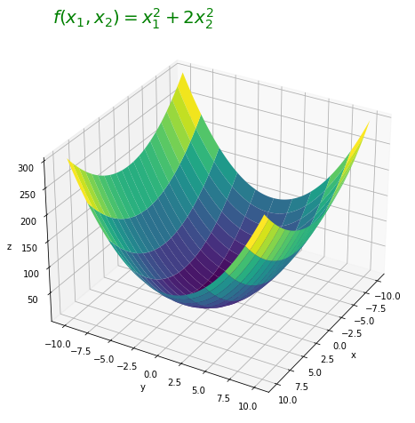
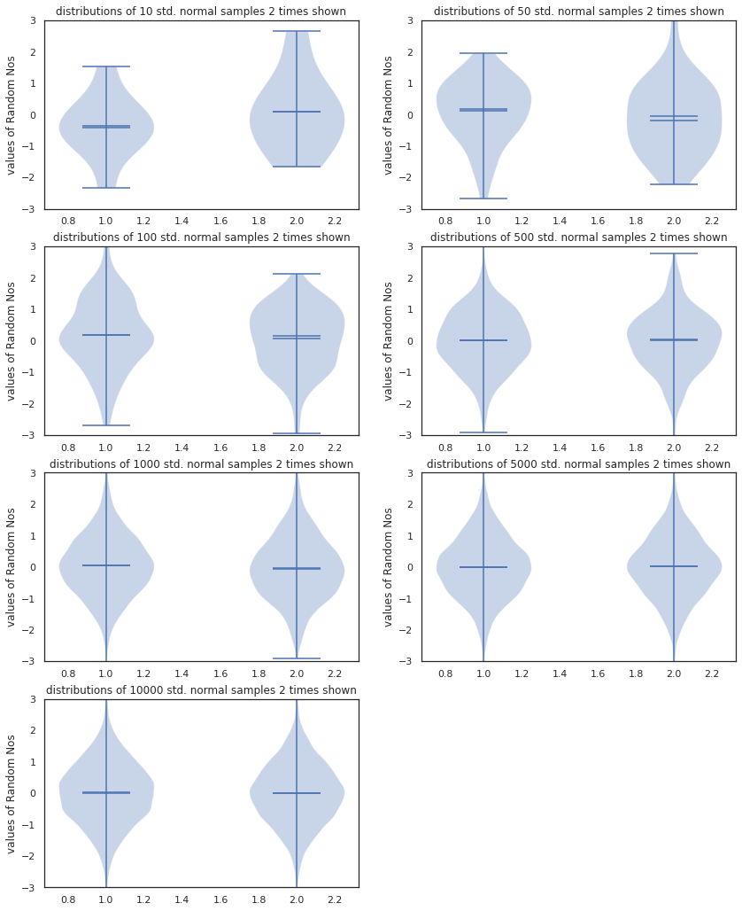
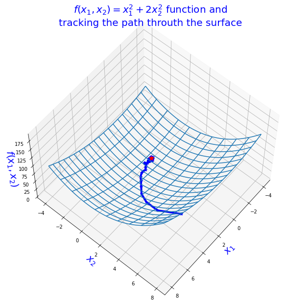
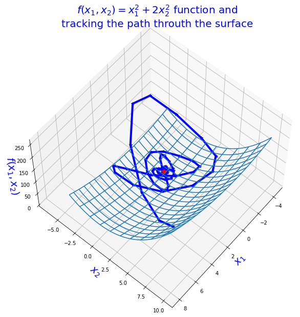

# Optimization-Algorithm
For learning, visualizing and understanding the optimization techniques and algorithms.
#
#
#

Visualizations and in depth concepts of the Machine Learning optimization algorithms are discussed and shown here with different functions as examples and understanding the differences by comparing  them.
## Over all types of Line and direction search algorithms in Gradient Descent discussed here: :shipit:
- Line search & direction search in Gradient Descent:
  - >> Exact Methods:
    - > Using derivatives ( for differentiable functions only):
      - Newton's method
      - Secant Method
    - > Without using derivatives (require function evaluation only):
      - Golden Section
      - Fibonacci
      - Bisection
  - >> Inexact method  (step length found is not exactly optimal )  {these are parameter specific}:
      - Armijo
      - Wolf-Powell

# 
<!-- * Line search & direction search in Gradient Descent:
+     Exact Methods:
*         Using derivatives ( for differentiable functions only):
*             Newton's method
*             Secant Method
*         Without using derivatives (require function evaluation only):
*             Golden Section
*             Fibonacci
*             Bisection
*     Inexact method  (step length found is not exactly optimal )  {these are parameter specific}:
*         Armijo
*         Wolf-Powell -->

Here All optimization techniques are explained through code. You can find the codes inside the ipynb files along with some explanation. The codes are very simple to understand, if the theory is clear to you. ( In future I will put some easy explanation and theory here )
First go through the file " complete_OPTAL.ipynb" then go through "GD_SGD_MNGD_momentum.ipynb" initially with the pdf. If you want to visualize the pots in other way checkout the "collection_of_plots.ipynb" . Now continue reading :point_down:

# 
### Example of Some Bivariate Functions: :+1:
Here we go,
First some visualizations of functions will definitely make you curious to know more about the optimization, so, 
look at the functions think how to find the minimum starting from a arbitrary point,

=\frac{sin(10(x^2+y^2))}{10}) 

We will work with simple univariate and bivariate functions for understanding,:yawning_face: One convex and one non-convex function is shown below,
-      

<!-- 

    

  

       

     

 -->
  
  
You can visualize some nice simple functions and other complex functions like Rosenbrock function :astonished: in the ipynb.
  
  
# 
We will go like this:
- [x] GD
- [x] SGD 
- [x] MINI BATCH  
- [x] MOMENTUM IN GD
### GD in Univariate function:

Next I will show some plots by which you will get some interest about Gradient descent,
Now see how zigzagging happens while reaching the minima starting from an arbitrary point, in the left side the value of the parameter is shown with iteration and in the right side function values are shown

Here you can see how step size gradually decrease near optima, and the ideal approximation of step length is shown with iteration using Armijo rule,

To reduce this long zigzag path we need to adjust learning rate or other parameters or need to apply various methods, after using these, as you can see below the zigzagging reduced ..again ignore all other terms just follow the curves, later you can understand why and how this hes been happened.

# 
### GD in Bivariate function:

Now the same thing for a bivariate function is shown in a contour plot, latter you can visualize it in a 3d plot also:

  
- [x] GD :tada:
- [ ] SGD 
- [ ] MINI BATCH  
- [ ] MOMENTUM IN GD

  
# 
### SGD in Bivariate function ( perturbed GD):

Now come to SGD[ stochastic gradient descent]
As we are not dealing with dataset directly, we here take simulation of that by adding random noise from normal distribution, and then follow how the difficulty is getting increased by adding this noise, and this problem looks like a **Stochastic Gradient Descent** problem, latter we will reduce this noise by taking average of some random noise to simulate the **Mini BAtch Gradient Descent** ( OK, so you have to be good with random numbers in python, :writing_hand: Here I attached one plot to get you idea how you can play with it to see differences) Follow the sampling, i.e, sample number and its distribution, When the sample variance is large this is a simulation of SGD and when the variance is low this is same as a  Mini Batch GD.

  

# 
## Dynamic step size:
As we have added noise to perform a SGD, it becomes tough now to reach the minima within affordable iteration number. So, for that we have to control the step size wisely(in the plot below, the step size is polynomially controlled for other methods go to the first portion of the "GD_SGD_MBGD_momentum.ipynb"). In the figure below, The change of the parameters, function value, function value near minima, gradient norm value step size is shown with iteration. Also you can visualize how the minima is reached in a contour plot as well as in a 3d plot.

-  - 
  
  
# 
## Comparison of different methods of dynamic step size:
Here polynomially decreases step size is used but you can use exponential functions to handle  , or you may keep it constant or step wise decreasing, a plot showing comparison among these different methods are shown here,,, these different methods behave differently in different function, so be careful. But in most cases Polynomially decreasing  is doing better control. The below methods are discussed inside the ipynb file.
- [x] Constant Learning Rate ,i.e value of  is constant with iteration. As a result step length will decrease with decrease in gradient value
- [x] Step Wise decreasing LR , i.e, LR is reduced by a fraction when function balue in any iteration is increased
- [x] Exponentially decresing LR with iteration 
- [x] Polynomially decreasing LR

  
# 
## For the non-convex Surface:
Finally we will see how tough this is for a non-convex surface ( the function used here is shown above   ),

- [x] GD :tada:
- [x] SGD :tada:
- [x] MINI BATCH :tada:  
- [ ] MOMENTUM IN GD

  
# 
## Momentum updation in GD:
And finally We will use momentum updation to handle these difficulties. Momentum help the point keep going in a direction resultant of its momentum at that point and gradient and helps not to stuck in local minima or saddle point. Here to show the change I purposefully kept the momentum parameter high, so you can see that though it know in which direction the minima is , but it will take its momentum in consideration. As a result it takes a long way, but if you reduce momentum controlling parameter it will help,

Thats it. Go to the ipynb files now.
  

- [x] GD :tada:
- [x] SGD :tada:
- [x] MINI BATCH :tada:  
- [X] MOMENTUM IN GD :tada:
  
  
**
Also I think, it will be better if anyone want to help me by just making the ipynb files more understandable by separation the topics.
If you feel hard anywhere, contact me in mahendranandi.0608@gmail.com
**

<!--  -->
